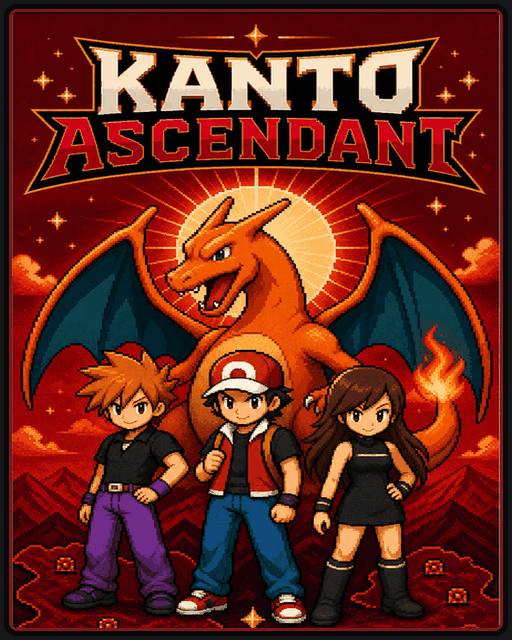
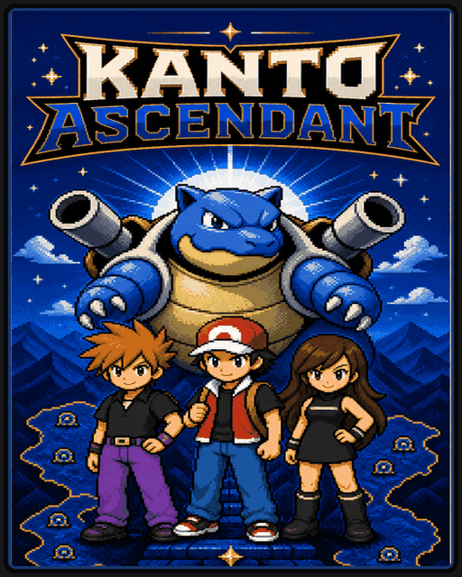
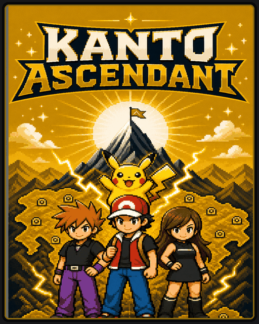

# KASC Cards

Custom Cards for **Kanto Ascendant + Voxel Ascendant** in Gen1Recomp.
This repository packages the launch configuration and edition artwork only.
It contains **no KASC/VASC mod code and no ROMs**.

| Red | Blue | Yellow |
| --- | --- | --- |
|  |  |  |

## Download

[Download the three Cards — v1.3.0-rc.3](https://github.com/Roxas2712/kasc-cards/releases/tag/v1.3.0-rc.3)

This is the same byte-identical Card set previously published with KASC RC3.
Moving it here does not change Card IDs, artwork, versions or save scope.

### Required pair

- **KASC 6.7.0-rc.3** — [separate mod release](https://github.com/Roxas2712/kanto-ascendant/releases/tag/v6.7.0-rc.3).
  The **Riolu → Lucario hotfix is implemented in this mod**, so it also works
  when launched through these Cards. The mod remains separately downloadable.
- **VASC RC66g / 3.0.0-rc.15** — [separate mod release](https://github.com/Roxas2712/voxel-ascendant/releases/tag/v3.0.0-rc66g).

Both mods are required and pinned by version and archive SHA256. Cards do not
silently substitute untested future releases or duplicate the mods' code.

## Installation

1. Back up your saves and import your own matching ROM into a Recompiler
   supporting Custom Carts and mod indexes (tested host: 0.2.56).
2. Add this URL under the launcher's **Find mods** sources:

   https://raw.githubusercontent.com/Roxas2712/kasc-cards/main/kasc-card-index.json

3. Import the `.g1rcart` for your edition, install/update its pinned mods,
   then Play. Replace the old KASC mod when updating.

If automatic installation is unavailable, import the two exact mod ZIPs from
the linked releases manually, then open the Card. Do not install GitHub's
automatic **Source code** archives as mods. No ROM is distributed here.

Existing Card IDs are retained. Ordinary non-Card saves are not automatically
migrated into a Card's save scope. Back up before changing your setup.

[Deutsche Anleitung](INSTALLATION-DE.md) · [Discord announcement draft](DISCORD-EN.md)

## Existing links / rollback

The original KASC RC2/RC3 release assets and old index remain available.
The index here also retains the RC2 mod entry for old exact pins. New Card
downloads live here; gameplay hotfixes continue to live in the KASC repository.
Changing distribution location does not complete or enable deferred gameplay
features. See the separate mod release notes for known limitations.

## Verification

On 2026-09-07, KASC RC3 and VASC RC66g were promoted to regular public releases
without changing their files or internal version identifiers.
This exact pair passed the recorded Red/Blue/Yellow native Card boot,
Riolu evolution and save/reload tests on host 0.2.56. This is **not** a promise
that every setting, device or gameplay state is bug-free. VASC still lists an
unresolved released-GPU-object error after an unknown settings change. Older
KASC 6.6 packages may reject RC66g; do not downgrade a save to bypass a lock.
For a compatibility report, include both internal mod versions, Recompiler
version, platform, error text and reproduction steps.

`SHA256SUMS.txt` covers the three unchanged Cards. Their embedded artwork is
also available under `art/`. `verification.json` records identity, pin and art
checks performed through the native Cart codec. The Card index is checked
through the native ModIndex parser and exact-pin resolver before publication.
